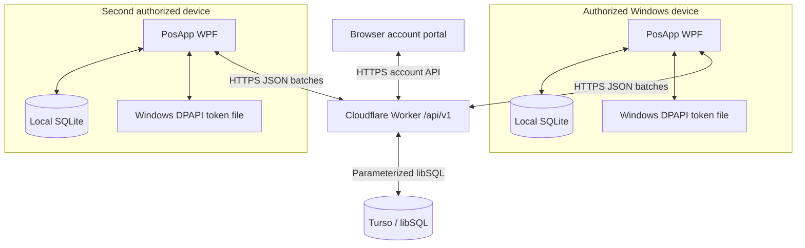
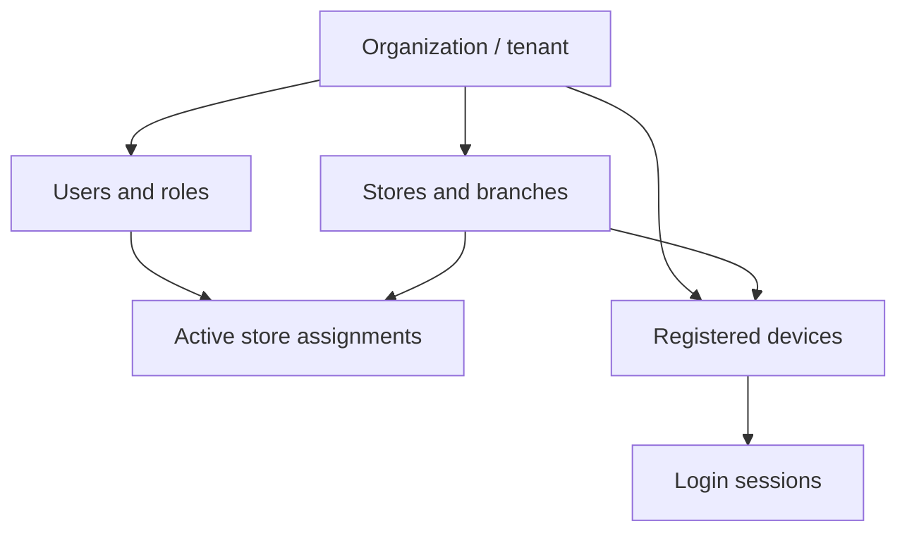

# PosApp 2.1 architecture

PosApp remains a local WPF application. Cloud connectivity is an optional synchronization boundary, not the runtime database for the register.

## Trust boundaries

- WPF is trusted to operate its local database but is not trusted to authorize cloud operations.
- The browser portal is an untrusted same-origin client. It receives only short-lived tenant user tokens and cannot bypass endpoint permission checks.
- The Worker derives the tenant, user, device, session, role, and permissions from a verified access token and current Turso state. Client-supplied identity or permission fields never grant access.
- The Worker owns all Turso credentials. Desktop builds and repositories contain no unrestricted database token or signing secret.
- Turso is not exposed as a public application protocol; all reads and writes pass through the Worker.

## Tenant hierarchy

Every cloud business envelope has server-controlled `tenant_id`, optional `store_id`, UUID `id`, timestamps, soft-deletion timestamp, version, creating/updating user, and last device. Tenant and store predicates are applied to every protected query. Non-administrators can pull or push only an active assigned store. Administrators can manage all stores in their tenant, never another tenant.

## Desktop composition

- Existing entities, views, services, reports, printing, themes, localization, build, installer, updater, and local backup code remain in place.
- A staged local restore is an exclusive startup operation. Shutdown drains synchronization and clears pooled SQLite handles; the next process validates a private copy, checkpoints the old WAL, locks the main/WAL/SHM/journal set, preserves the outgoing database, removes old sidecars, and atomically publishes the restored main file. Contention leaves both live and staged databases unchanged.
- `LocalOrganizationProfileStore` maintains a non-secret selector outside the tenant databases. The first upgraded installation remains the `legacy` profile at the original paths. Every added organization receives a random profile directory containing an independent SQLite cache, backup/restore scope, update migration-state records, and DPAPI token file; its device UUID, users, offline PIN verifiers, outbox, conflicts, identities, and cursors live only in that profile's database.
- EF Core resolves the active profile once when the process starts. Adding or selecting a profile first makes a best-effort sync, stops the background engine, atomically changes the selector, and restarts PosApp. This restart boundary prevents an open DbContext, transaction, report, or cart from changing tenant database mid-operation. Failed cloud connectivity leaves the old profile's pending work untouched and switchable later.
- `AppDbContext.SaveChangesAsync` snapshots tracked business changes and appends outbox rows in the same SQLite transaction.
- `SyncIdentity` maps preserved local integer keys to global UUIDs without rewriting historical foreign keys.
- `CloudSyncService` runs after login/startup, every two minutes, after outbox changes, after network recovery, on manual Sync, and during shutdown when time permits. Background calls coalesce immediately; a user-initiated/onboarding call waits asynchronously for an active cycle and then runs its own verified cycle, so a stale intermediate status cannot finalize or reject setup.
- Each online onboarding attempt carries a short correlation ID through authentication and the foreground sync. `CloudDiagnosticLogger` writes bounded JSON-lines records under the local application-data folder, including stage, cursor, queue/conflict summaries, Worker request IDs, and sanitized exception metadata. The periodic task explicitly drops the onboarding scope so unrelated later cycles cannot be misattributed.
- `SyncRecordApplier` applies ordered server pages in a SQLite transaction with outbox capture suppressed, then refreshable views see current local data without restart.
- One SQLite file can cache several authorized branches. Store-scoped query filters select the active working set, while formerly global SKU, barcode, category, setting, receipt, purchase-document, and open-register constraints are branch-aware. Identical catalog identifiers in two branches remain separate local rows and UUID identities. Login and branch switching reload the selected store's settings; the switch confirmation warns that the current unsaved cart is cleared so no draft, filter, receipt, printer, currency, theme, or language state crosses stores.
- DPAPI protects a separate access/refresh token bundle for each profile and the current Windows user. Non-secret organization/store/device metadata remains in that profile's SQLite database; the selector stores only friendly organization metadata and random profile IDs.
- First run is online-only. The local database initially contains only the SQLite schema; no independent administrator, store configuration, or bootstrap catalog is created. Signing in or creating an organization clears incomplete disposable bootstrap cache state and downloads the authoritative organization snapshot from cursor zero. Preparation and completion are separate device-local phases, so restart safely resumes the same full download. Device-local `app:` settings never enter the outbox.
- Linking an already-configured SQLite database first detects records without tenant-bound UUID identities, writes a verified safety backup, and raises the reconciliation gate. Background push and pull remain paused until an administrator either acquires the cloud-empty migration lease for the local snapshot or explicitly replaces the synchronized local working copy with server data.

## Cloud components

- The Worker entry point is `cloud/worker/src/index.ts`.
- The Worker root serves the tenant-scoped account portal; `/status` and `/api/v1/diagnostics` expose public deployment readiness without user data. Explicitly creating another portal organization allocates a fresh browser device UUID, while remembered non-secret identifier/device mappings allow normal sign-in reuse. A mismatched tenant device is retried once with a new UUID; Worker-side cross-tenant validation is never weakened.
- Authentication, store access, permissions, validation, synchronization, structured errors, and database access are separated by module.
- Turso migrations are append-only and tracked in `schema_migrations`.
- Domain data uses indexed server-owned envelope columns plus versioned JSON payloads. Branch-scoped normalized identifier indexes and a shared SKU/barcode namespace prevent duplicate master records without blocking the same identifier in another store. This keeps Worker CPU and migration cost low while retaining explicit tenant/version/tombstone enforcement.

## Preserved domain representation

The desktop model was extended in place rather than replaced. Cloud tables include the complete normalized synchronization vocabulary, while the v1.4.24 operational representation remains authoritative on each device:

| Existing desktop representation | Cloud synchronization representation |
|---|---|
| `Discount` with code/date/use limits | `discounts` payloads (the reserved `promotions` table supports a future split without an API break) |
| `Sale.Status = Suspended` | mutable/open sale in `sales`; recall retains the same UUID and receipt number |
| `Sale.Status = Voided/Refunded` and linked negative refund sale | immutable sale transition, linked sale/items/payments, and audit events (reserved `voided_sales`/`refunds` tables remain available for future projections) |
| `StockTransaction.Type` | append-only `inventory_movements`, including sale, refund, purchase, adjustment, and opening movements |
| `UnitOfMeasure` enum and product snapshot fields | versioned product/sale-item payloads (the reserved `product_units` table permits later custom units) |

This mapping preserves existing reports, printing, backups, integer foreign keys, and version history. It also avoids maintaining two competing local financial models.

## Version compatibility

Desktop protocol constants are in `CloudProtocol`; Worker versions are in `wrangler.toml`. Login and sync reject a client below `MINIMUM_CLIENT_SCHEMA_VERSION` or ahead of the server schema. API v1 routes remain under `/api/v1`; breaking protocols require a new versioned route rather than silently changing v1.
