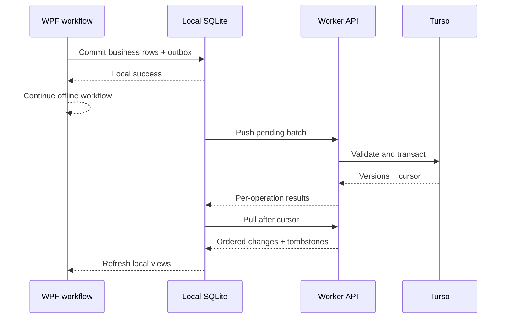

# Offline-first synchronization protocol

## Local commit invariant

One user action produces business rows and outbox rows in the same SQLite transaction. A successful local sale never waits for a network request. If outbox serialization fails, the transaction is rolled back and the local operation reports failure instead of leaving unsynchronizable data.

## Identifiers and ordering

- Existing SQLite integer IDs are retained. `SyncIdentities` assigns a UUID record ID and maps every relationship to the referenced UUID in transport payloads.
- Dependency order is masters, products, register/sale/purchase headers, child items/payments, then inventory/cash movements.
- A device UUID and operation UUID are generated locally. The separate idempotency key prevents a retry or uncertain response from applying the operation twice.
- All protocol timestamps use UTC. Correctness depends on versions and cursors, not client clock ordering.

## Push

`POST /api/v1/sync/push` contains the device, selected store, client schema version, and at most two operations. Each operation includes `operationId`, `idempotencyKey`, entity/record UUID, optional store, `upsert` or `delete`, the last observed server version, payload, and client timestamp. The deliberately small batch is still transactional and amortizes request overhead, while leaving headroom for the multiple relationship, ledger, idempotency, audit, and composition statements needed by a worst-case financial operation under the Workers Free external-subrequest ceiling. One foreground cycle sends up to 20 such batches and resumes remaining work safely.

The Worker, inside a write transaction:

1. Revalidates the access token, session, active user, device, organization, assigned store, and entity-specific permission.
2. Rejects unknown entities, oversize/invalid payloads, cross-tenant/store access, and duplicate identifiers within a batch.
3. Looks up prior operations by tenant-scoped operation and idempotency keys.
4. Compares `baseVersion` with the current record version.
5. Opens a per-operation SQLite savepoint, then writes the server-owned tenant/store/audit envelope and payload with parameterized SQL.
6. Appends a global monotonic `sync_changes` cursor and security/financial audit row. A rejected operation rolls back to its savepoint, so no partial record, cursor, or audit row can survive while other valid batch operations commit.
7. Enforces branch-scoped normalized master identifiers, including one shared SKU/barcode namespace, and immutable receipt/document/ledger-source identifiers.
8. Returns a result for each operation, including accepted duplicate, new version, conflict payload, or safe error code.

Transient failures return operations to Pending with jittered exponential backoff capped to roughly five minutes. Validation/permission failures remain visible for explicit correction. An interrupted HTTP response is safe because the same idempotency key is retried.

## Pull

`GET /api/v1/sync/pull?cursor=N&storeId=UUID&limit=100` returns only changes with cursor greater than `N`, scoped to global tenant records or the authorized store. Pages are capped at 200. Each device maintains a separate cursor for every tenant/store scope. The desktop applies a page transactionally, in dependency order, and advances that scope's cursor only after success.

Tombstones carry `deletedAtUtc`; rows are not hard-deleted during normal sync. Ordinary views exclude tombstoned identities while local historical financial rows remain available for referential integrity.

## Conflicts

Master data such as products, customers, suppliers, categories, discounts, and settings uses optimistic record versions. If both sides changed after the last common version, PosApp stores local/server payloads in `SyncConflicts`, pauses that record, and offers **Keep local** (rebase and retry) or **Use server** (discard the pending edit and apply the server payload). Every resolution remains diagnosable and is audited by the Worker when synchronized.

Finalized financial entities are not last-write-wins:

- Payments, sale/purchase items, inventory movements, cash movements, and expenses are append-only after creation.
- Suspended/open sales are the exception: saving or completing a recalled sale retains its existing UUID and receipt number. Draft lines are uploaded while the server header is still suspended, then the header is finalized; once finalized, those lines return to append-only protection. An insert deleted before its first upload is cancelled locally instead of sending a meaningless cloud tombstone.
- A completed sale can transition to voided/refunded only with its financial facts unchanged; refund/void permissions are checked independently.
- A posted purchase can only be voided without rewriting totals; correction uses new inventory movements.
- A closed register session cannot be rewritten.
- Inventory quantity is rebuilt from signed movement records. Product balance-only recalculations do not create outbox edits, and the Worker strips any client `stockQuantity` field from product writes, preventing competing devices from overwriting a shared stock number.
- The Worker verifies linked records in the same tenant/store and reconciles sale lines, tender totals, cumulative payments, purchase lines, and inventory source quantities before committing a batch.
- Sale and purchase headers declare immutable expected line/payment counts. A new finalized transaction, or completion of a previously suspended sale, is held in a server-side composition stage while bounded batches arrive. Pull hides that header and its staged children. After the final child reconciles exactly to the header subtotal, discount, tax, total, and payment amount, the Worker atomically marks the composition complete and publishes a cursor-ordered header/child replay. An interrupted upload therefore remains private instead of appearing as a half-completed transaction on another device.
- A normal sale line names its synchronized catalog version. The Worker resolves that current/historical product snapshot and verifies price, cost, tax, unit, and whether discounting was allowed. Refund lines instead reconcile to the referenced immutable original line and cumulative returned quantity.

## Initial migration

1. When an already-configured installation is linked, PosApp detects rows without valid identities for that tenant, creates a verified backup, and blocks background push and pull before cloud data is applied locally.
2. The administrator creates/signs into the organization, selects the store, previews local/cloud counts, and explicitly chooses the local snapshot.
3. PosApp acquires a 24-hour server-side migration lease that atomically rechecks the organization is empty. Other devices cannot push into that store while it is active. If the lease expires during a long outage, only the same tenant/store/user/device can renew its recorded migration ID and continue the idempotent snapshot; it does not need to pretend the now-partially-populated cloud is empty.
4. A validated SQLite backup is retained.
5. Existing rows receive UUID identities without changing integer keys.
6. The snapshot is queued in dependency order and uploaded through normal idempotent batches.
7. PosApp checks pending/conflict counts and compares server entity counts.
8. A summary shows the retained backup and verification state.
9. PosApp closes the lease only after server counts verify; an interrupted owner device can resume from its atomically retained local snapshot marker and idempotent outbox. If completion reached Turso but its HTTP response was lost, `/sync/status` identifies the latest completed migration for that user/device and PosApp verifies counts before finalizing locally.

Large databases may require multiple manual Retry cycles because one foreground cycle deliberately caps pages/batches to protect the Worker free plan. Progress is retained.

For databases created before purchase-line ledger links existed, the local schema upgrader deterministically backfills purchase document/item references from the original document note and line order before enabling schema-v4 synchronization. Ambiguous legacy rows remain visible locally and are reported for reconciliation instead of being guessed into a financial source.

## Local/cloud and backup-restore reconciliation

The same `RequiresReconciliation` gate protects both an existing local database being linked for the first time and a staged local restore. On startup after a restore, PosApp recovers the encrypted account scope from the retained safety database when needed, resets the pull cursor, and blocks both upload and download. The administrator must explicitly choose server state, or validate that the cloud organization is empty before uploading local data as a new state. **Use server** clears synchronized operational rows and sync metadata in dependency-safe order before replaying cloud state; local users are retained only for cached PIN identity. Older local rows are never silently pushed over newer cloud versions.
